# Clean Architecture

## preface

The languages have gotten a little better. The tools have gotten fantastically better. But the basic building blocks of a computer program have not changed.

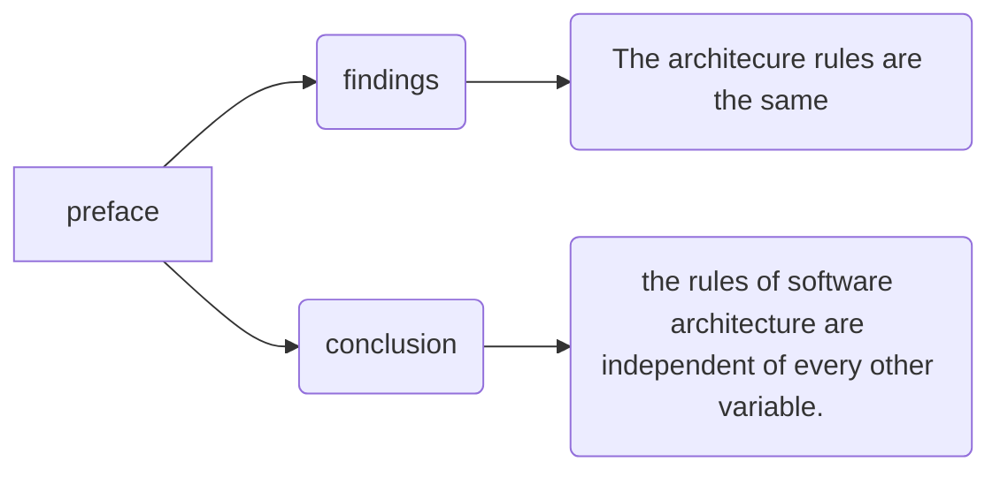

## Part 1 Introduction

### Charpter 1 What is design and architecture

For starters, the auther asserts that there is no difference between design and architecture.

The measure of design quality is simply the measure of the effort required to meet the needs of the customer. If that effort is low, and stays low throughout the lifetime of the system, the design is good.

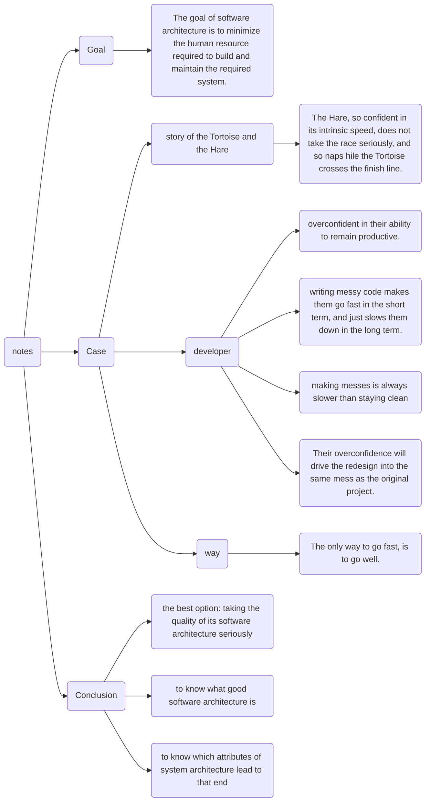

### chapter 2 A Tail of Two Values

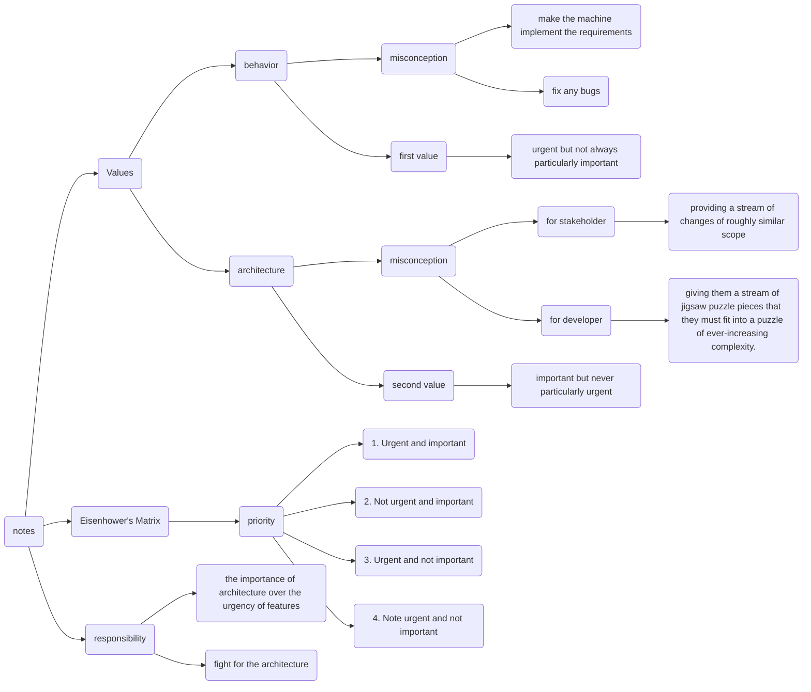

# Part 2 Starting with the Bricks: Programming Paradigms

## Chapter 3 Paradigm Overview

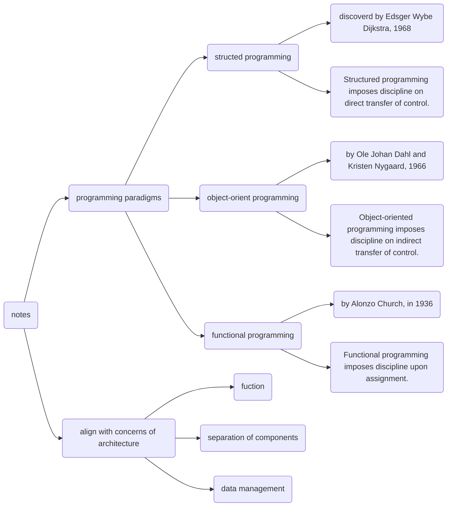

## Chapter 4 Structured Programming

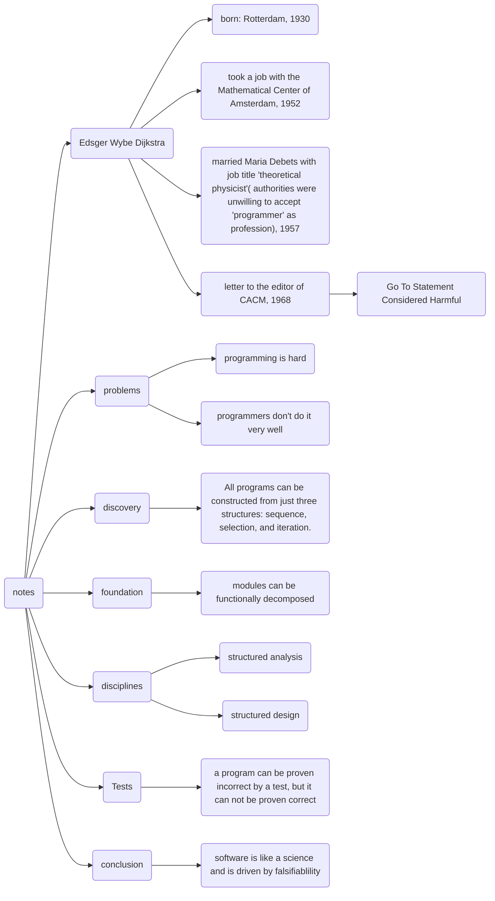

## Chapter 5 Object-Oriented Programming 

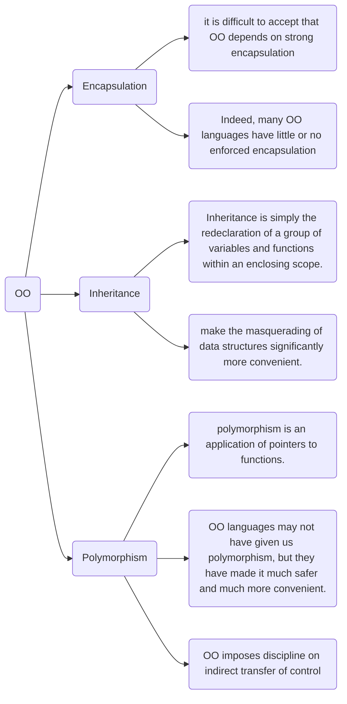

OO is the ability, through the use of polymorphism, to gain absolute control over every source code dependency in the system. It allows the architect to create a plugin architecture, in which modules that contain high-level policies are independent of modules that contain low-level details. The low-level details are relegated to plugin modules that can be deployed and developed independently from the modules that contain high-level policies.

## Chapter 6 Functional Programming

If we have enough storage and enough processor power, we can make our applications entirely immutable—and, therefore, entirely functional.

## Conclusion
Software—the stuff of computer programs—is composed of sequence, selection, iteration, and indirection. Nothing more. Nothing less.

# Part 3 Design Principles

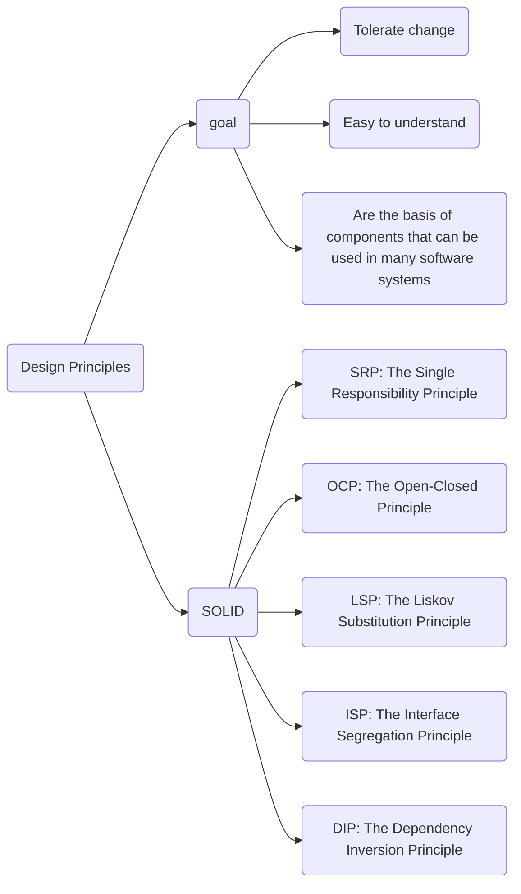

## Chapter 7 SRP: The single responsibility principle

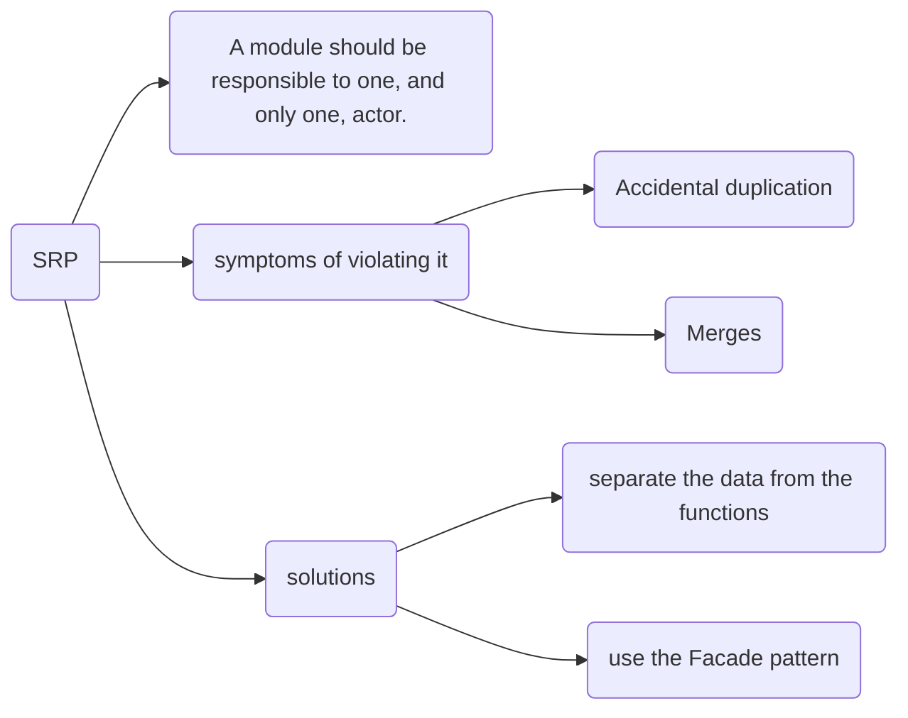

The Single Responsibility Principle is about functions and classes—but it reappears in a different form at two more levels. At the level of components, it becomes the Common Closure Principle. At the architectural level, it becomes the Axis of Change responsible for the creation of Architectural Boundaries.

## Chapter 8 OCP: The Open-Closed Principle

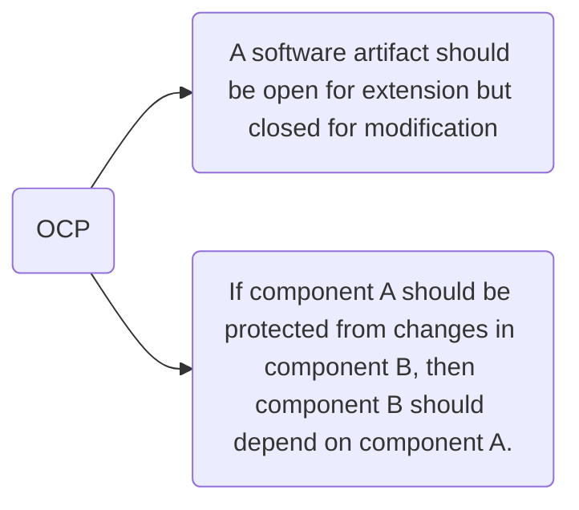

## Chapter 9 LSP: The Liskov substitution Principle

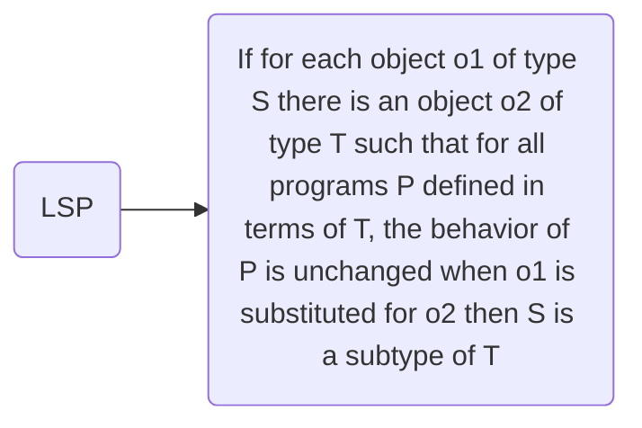

## Chapter 10 ISP: The Interface Segregation Principle

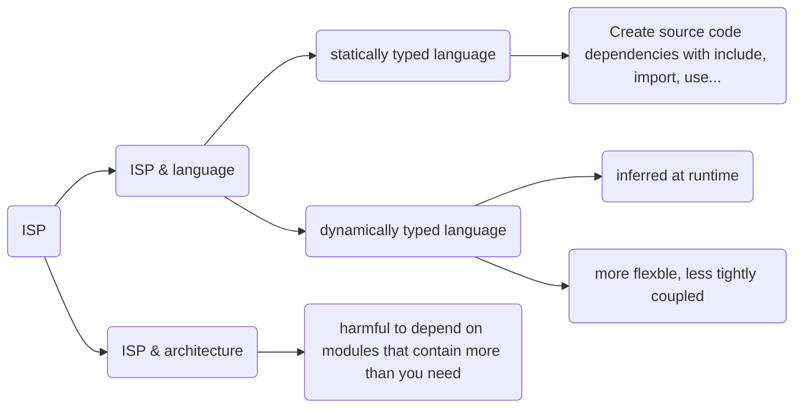

## Chapter 11 DIP: The Dependency Inversion Principle

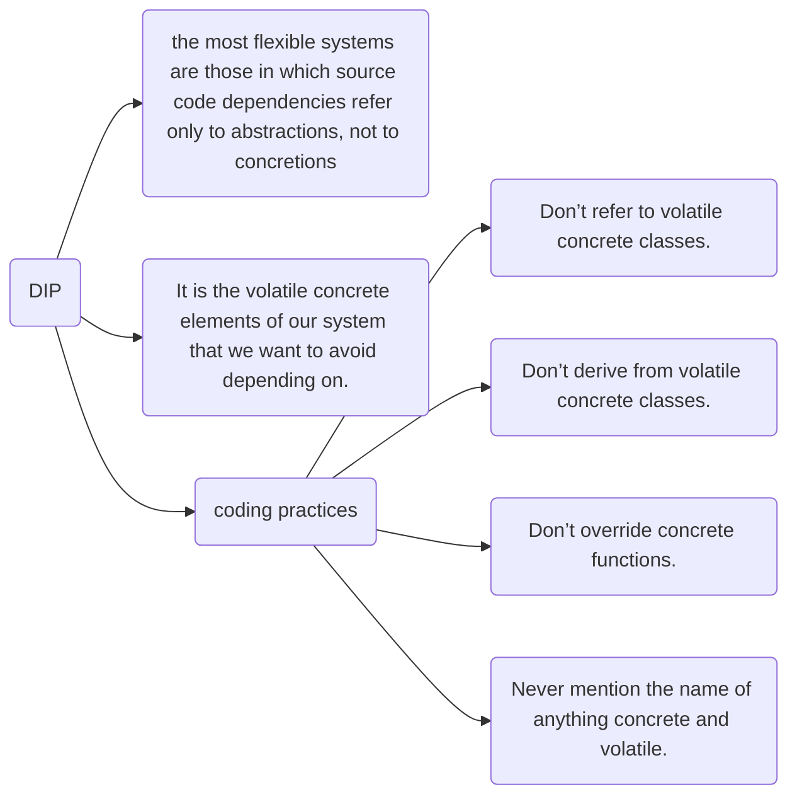

# Part 4 Component Principles

## Chapter 12 Components

Components are the smallest entities that can be deployed as part of
a system.
Regardless of how they are eventually deployed, well-designed components always retain the ability to be independently deployable and, therefore, independently developable.

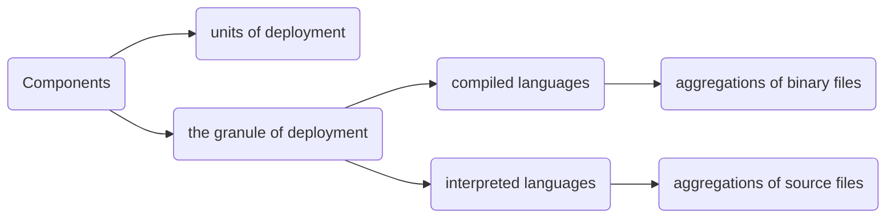

## Chapter 13 Component Cohesion

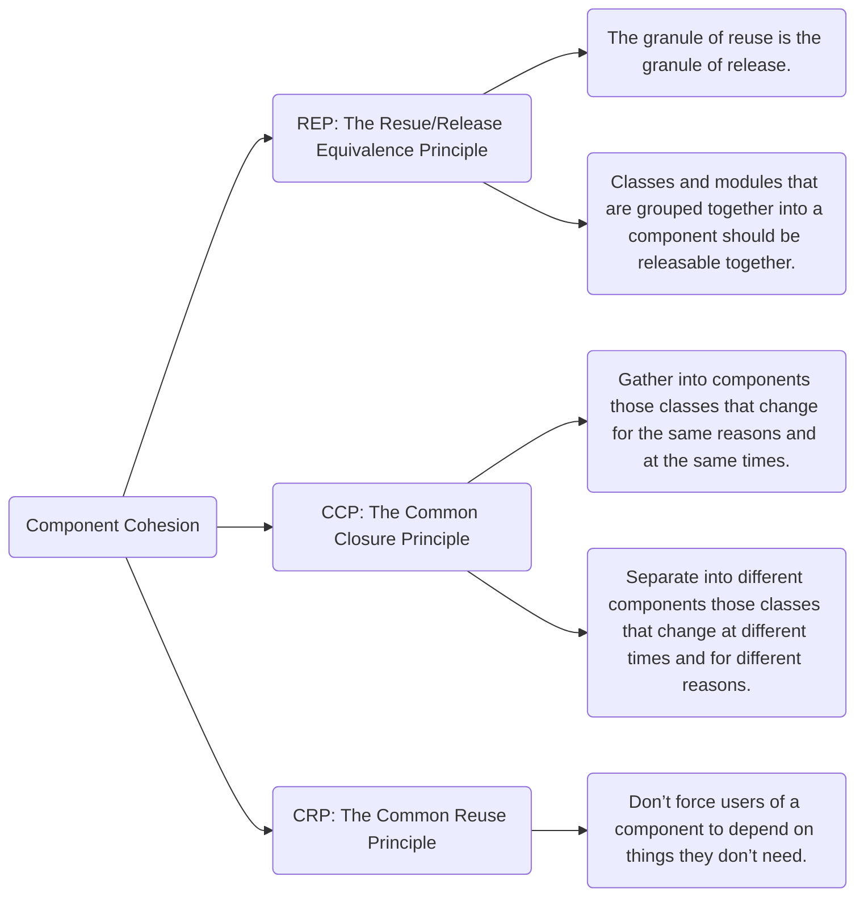

## Chapter 14 Component Coupling

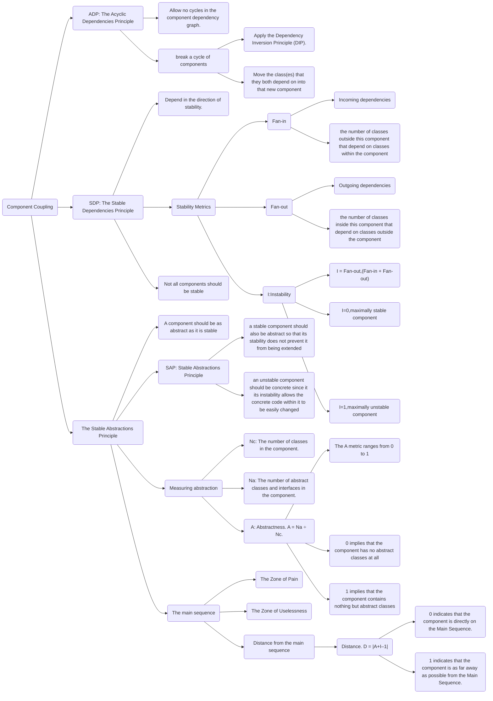
### ADP
The component structure cannot be designed from the top down. It is not one of the first things about the system that is designed, but rather evolves as the system grows and changes.
Component dependency diagrams have very little do to with describing the function of the application. Instead, they are a map to the buildability and maintainability of the application. This is why they aren’t designed at the beginning of the project.

### SDP
Any component that we expect to be volatile should not be depended on by a component that is
difficult to change.

# Part 5 Architecture

## Chapter 15 What is architecture

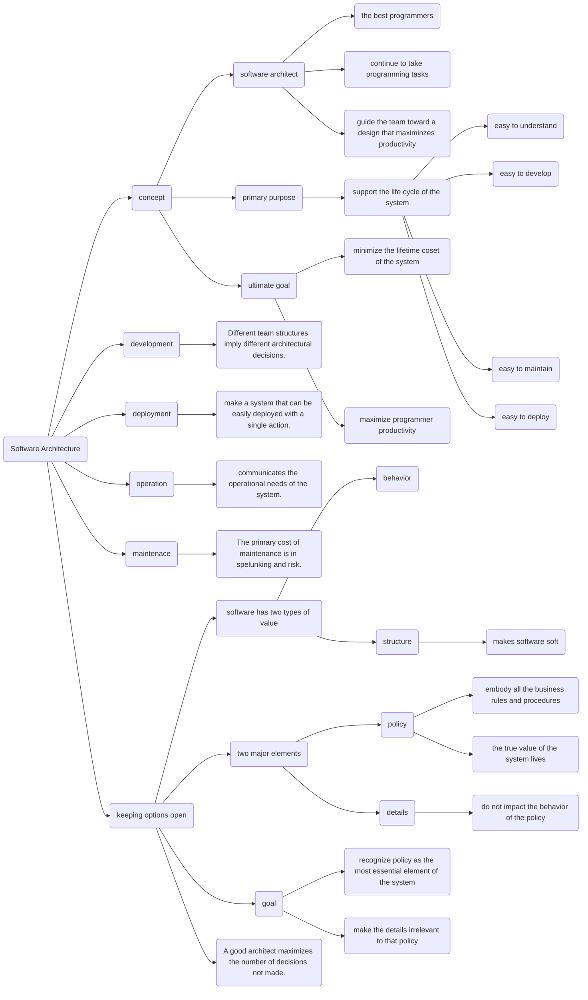

