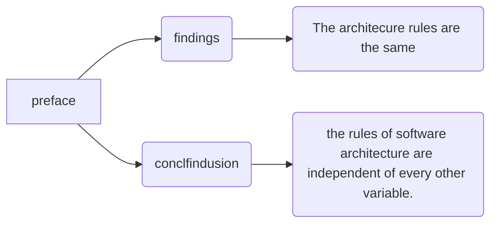

# Clean Architecture

## preface

The languages have gotten a little better. The tools have gotten fantastically better. But the basic building blocks of a computer program have not changed.



## Part 1 Introduction

### Charpter 1 What is design and architecture

For starters, the auther asserts that there is no difference between design and architecture.

The measure of design quality is simply the measure of the effort required to meet the needs of the customer. If that effort is low, and stays low throughout the lifetime of the system, the design is good.


```Mermaid
graph LR;
Ch0(notes) --> Ch1(Goal);
Ch1 --> CH11(The goal of software architecture is to minimize the human resource required to build and maintain the required system.);

Ch0 --> Ch2(Case)
Ch2 --> Ch21(story of the Tortoise and the Hare)
Ch21 --> Ch211(The Hare, so confident in its intrinsic speed, does not take the race seriously, and so naps hile the Tortoise crosses the finish line.)
Ch2 --> Ch22(developer)
Ch22 --> Ch221(overconfident in their ability to remain productive.)
Ch22 --> Ch222(writing messy code makes them go fast in the short term, and just slows them down in the long term.)
Ch22 --> Ch223(making messes is always slower than staying clean)
Ch22 --> Ch224(Their overconfidence will drive the redesign into the same mess as the original project.)
Ch2 --> Ch23(way)
Ch23 --> Ch231(The only way to go fast, is to go well.)

Ch0 --> Ch3(Conclusion)
Ch3 --> Ch31(the best option: taking the quality of its software architecture seriously)
Ch3 --> Ch32(to know what good software architecture is)
Ch3 --> Ch33(to know which attributes of system architecture lead to that end)

```

### chapter 2 A Tail of Two Values

```Mermaid
graph LR
Ch0(notes) --> Ch1(Values)
Ch1 --> Ch11(behavior)
Ch1 --> Ch12(architecture)

Ch11 --> Ch111(misconception)
Ch111 --> Ch1111(make the machine implement the requirements)
Ch111 --> Ch1112(fix any bugs)

Ch12 --> Ch121(misconception)
Ch121 --> Ch1211(for stakeholder)
Ch1211 --> Ch12111(providing a stream of changes of roughly similar scope)
Ch121 --> Ch1212(for developer)
Ch1212 --> Ch12121(giving them a stream of jigsaw puzzle pieces that  they must fit into a puzzle of ever-increasing complexity.)

Ch0 --> Ch2(Eisenhower's Matrix)
Ch2 --> Ch21(priority)
Ch21 --> Ch211(1. Urgent and important)
Ch21 --> Ch212(2. Not urgent and important)
Ch21 --> Ch213(3. Urgent and not important)
Ch21 --> Ch214(4. Note urgent and not important)


Ch11 --> Ch112(first value)
Ch12 --> Ch122(second value)
Ch112 --> Ch1121(urgent but not always particularly important)
Ch122 --> Ch1221(important but never particularly urgent)

Ch0 --> Ch3(responsibility)
Ch3 --> Ch31(the importance of architecture over the urgency of features)
Ch3 --> Ch32(fight for the architecture)

```
