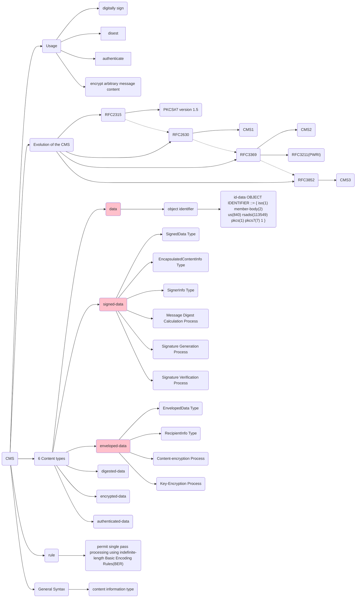

# Cryptographic Message Syntax (CMS)

```mermaid
graph LR;
A0(CMS) --> A01(Usage);

A01 --> A011(digitally sign);
A01 --> disest;
A01 --> authenticate;
A01 --> A012(encrypt arbitrary message content);

A0 --> A02(Evolution of the CMS) 

A02 --> A021(RFC2315);
A021 --> A0211(PKCS#7 version 1.5);

A02 --> A022(RFC2630);
A022 --> A0221(CMS1);

A02 --> A023(RFC3369);
A023 --> A0231(CMS2);
A023 --> A0232("RFC3211(PWRI)")

A02 --> A024(RFC3852);
A024 --> A0241(CMS3);

A021 -.-> A022;
A022 -.-> A023;
A023 -.-> A024;

A0 --> A03(6 Content types);

A03 --> A031(data);
A03 --> A032(signed-data);
A03 --> A033(enveloped-data);
A03 --> A034(digested-data);
A03 --> A035(encrypted-data);
A03 --> A036(authenticated-data);

style A031 fill:pink
style A032 fill:pink
style A033 fill:pink

A0 --> A04(rule);
A04 --> A041("permit single pass processing using indefinite-length Basic Encoding Rules(BER)");

A0 --> A05(General Syntax);
A05 --> A051(content information type);

A031 --> A0311(object identifier);
A0311 -->A03111("id-data OBJECT IDENTIFIER ::= { iso(1) member-body(2)
us(840) rsadsi(113549) pkcs(1) pkcs7(7) 1 }");


A032 --> A0321(SignedData Type)
A032 --> A0322(EncapsulatedContentInfo Type)
A032 --> A0323(SignerInfo Type)
A032 --> A0324(Message Digest Calculation Process)
A032 --> A0325(Signature Generation Process)
A032 --> A0326(Signature Verification Process)

A033 --> A0331(EnvelopedData Type)
A033 --> A0332(RecipientInfo Type)
A033 --> A0333(Content-encryption Process)
A033 --> A0334(Key-Encryption Process)

```